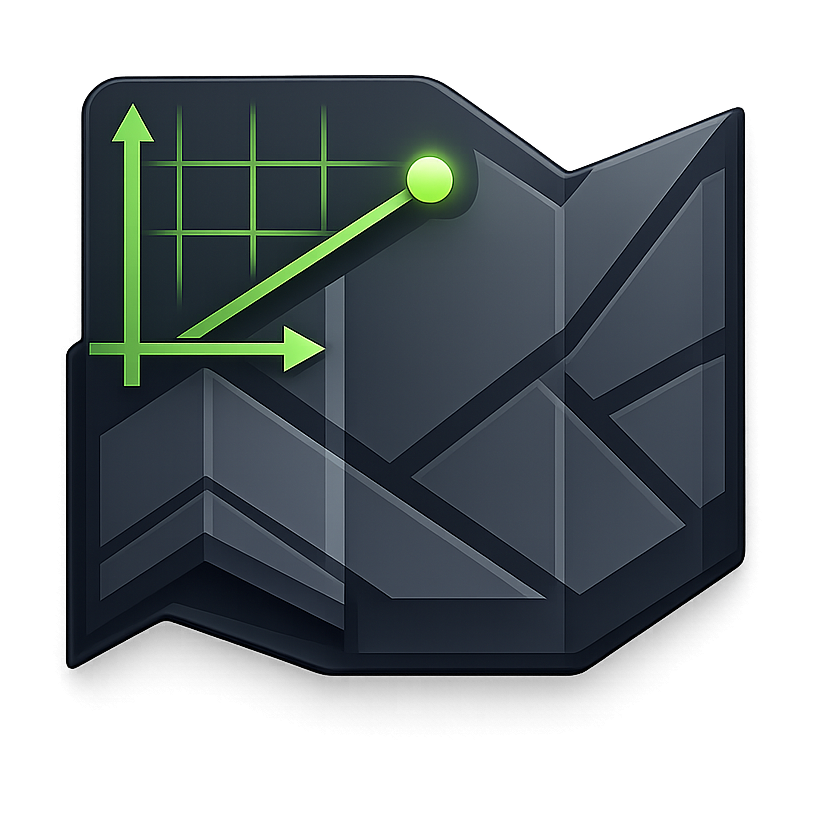
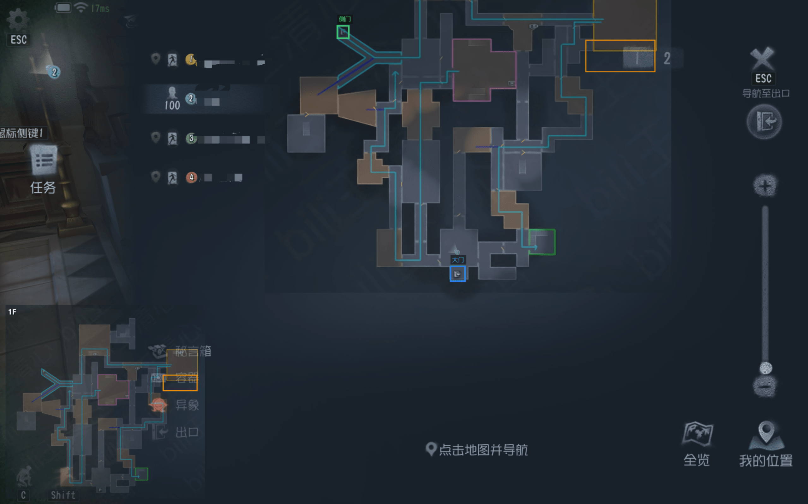
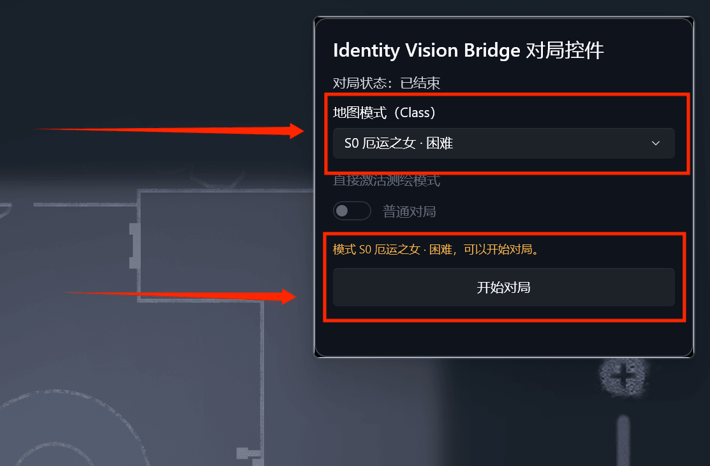
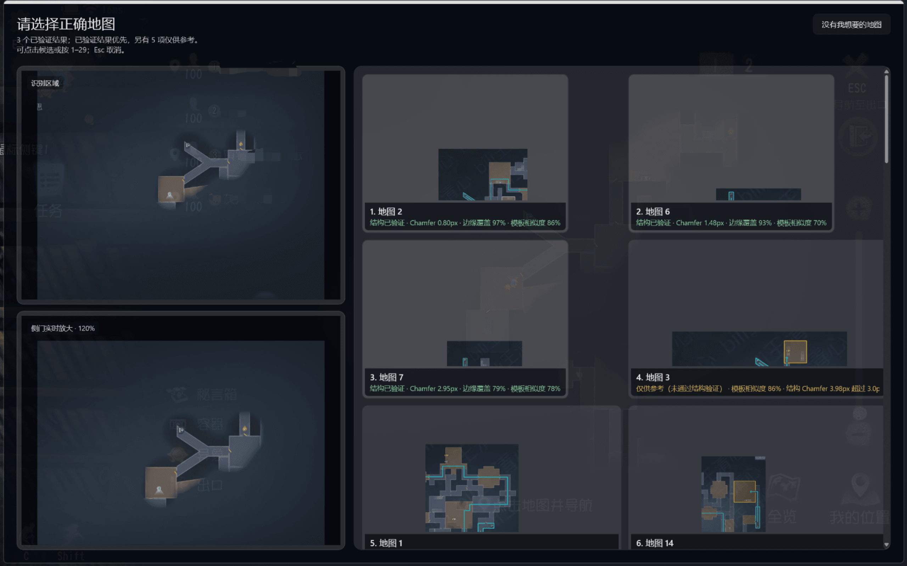
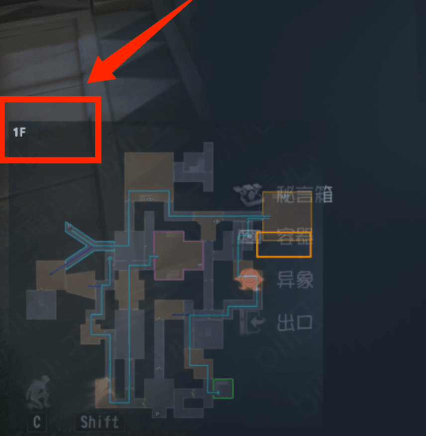

<div align="center">
  

  # Identity Vision Bridge

  **让攻略地图真正贴进游戏画面。**

  IDVB 是一个面向 Windows 桌面场景的实时地图识别与可视化叠加工具。<br>
  它会识别游戏内地图，将 IDVM 攻略图与原生地图对齐，并以叠加层的方式持续呈现。

  [](https://idvb.xgflee.com/download)
  [](https://dotnet.microsoft.com/)
  [](https://github.com/xigefuli-dev/IDVB/releases)
  [](LICENSE)

  [下载安装](https://idvb.xgflee.com/download) · [地图社区](https://community.idvb.xgflee.com/) · [提交问题](https://github.com/xigefuli-dev/IDVB/issues)
</div>

---

## 它能做什么？

- **识别地图**：打开游戏原生地图后触发扫描，从本地地图中找到当前对局。
- **实时对齐**：将攻略地图缩放、旋转并贴合到游戏原生地图上。
- **多楼层显示**：为不同楼层保留独立的地图与对齐状态，随时切换。
- **IDVM 地图包**：导入、编辑和分享统一的 `.idvm` 攻略地图。
- **地图社区**：发现并订阅社区地图，让地图更新更省心。
- **可扩展插件**：通过隔离的插件系统添加个性化能力。

<p align="center">
  
</p>

## 三步开始

### 1. 开始对局

呼出对局控件，选择本局模式，然后点击“开始对局”。

<p align="center">
  
</p>

### 2. 扫描地图

在游戏内打开原生地图并按下扫描快捷键。IDVB 会识别地图；结果不唯一时，你可以从候选图中亲自确认。

<p align="center">
  
</p>

### 3. 查看叠加层

识别完成后，攻略图会显示在游戏画面中。再次打开原生地图即可进行对齐；多层地图可以单独切换楼层。

<p align="center">
  
</p>

> [!TIP]
> 更完整的图文操作说明已经内置在应用的“使用指南”中。

## 下载与使用

普通用户请前往 **[IDVB 下载页](https://idvb.xgflee.com/download)** 获取安装包。应用内置更新功能，无需手动替换程序文件。

使用前请确认：

- Windows 10 1809 或更高版本，推荐 Windows 11；
- 游戏使用窗口化或无边框窗口模式；
- 阅读应用内引导，并按自己的键位完成快捷键设置。

> [!IMPORTANT]
> IDVB 是独立的非官方项目，与网易、《第五人格》及其开发、发行或运营方不存在隶属、合作、赞助或认可关系。请遵守适用法律、游戏用户协议与平台规则。

## 从源码构建

项目基于 WinUI 3 与 .NET 10。安装对应的 .NET SDK 和 Windows 开发环境后，在仓库根目录执行：

```powershell
dotnet build
```

开发或提交改动前，请先阅读仓库内的开发、测试与 IDVM 格式说明。

## 支持项目

IDVB 的开发、地图工具、社区服务和下载服务都需要持续维护。如果它帮到了你，欢迎：

- 给仓库点一颗 ⭐，让更多人发现它；
- 提交清晰的错误报告或功能建议；
- 在地图社区分享高质量的 IDVM 地图；
- 通过 **爱发电** 支持后续开发（主页即将开放）。

<!-- 爱发电创作者主页开通后，将上一行替换为：通过 [爱发电](https://afdian.com/a/你的主页) 支持后续开发。 -->

所有支持都应当是自愿的；不赞助也不会影响项目的基本下载、反馈与使用。

## 许可与贡献

源代码以 [Identity Vision Bridge 非商业源码许可 1.0](LICENSE) 提供。它允许个人学习、学术研究及其他非商业用途，但不属于 OSI 定义的开源许可证，也不允许未经授权的商业使用或作弊用途。

欢迎通过 Issue 参与讨论。提交代码前，请确保改动范围清晰、不包含日志、缓存、构建产物或其他无关文件。请勿在公开 Issue 中披露可利用的安全问题、真实用户数据或个人信息。

---

<div align="center">
  <sub>Built with care for clearer maps and calmer matches.</sub>
</div>
